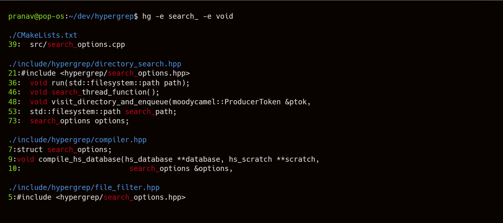
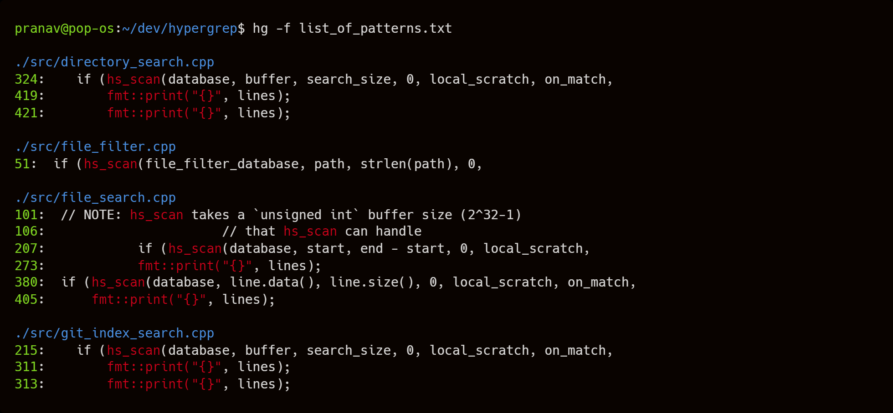

## Table of Contents

- [Getting Started](#getting-started)
  * [Simple Search](#simple-search)
  * [Multiple Patterns](#multiple-patterns)
  * [Locating the Match with `--byte-offset` and `--column`](#locating-the-match)
  * [Counting Matches](#counting-matches)
- [Usage](#usage)
- [Options](#options)

## Getting Started

The implementation of `hypergrep` is based on `grep` and `ripgrep`. 

The program can be used in one of a few different ways:

1. Single pattern, searching a single path (if no path is provided, the current directory is searched).
1. Single pattern, searching multiple paths.
2. Multiple patterns provided via `-e` option, searching multiple paths.
3. Multiple patterns provided via a pattern file, searching multiple paths.
4. No patterns, just interested in what files _will_ be searched (using `--files`)

### Simple Search

The simplest of these is searching the current working directory for a single pattern. The following example searches the current directory for the literal pattern `mmap`.
  

  
The output indicates 4 matches across 2 different files.
  
When piping `hypergrep` output to another program, e.g., `wc` or `cat`, the output changes to a different format where each line represents a line of output. 
  

  
### Multiple Patterns
  
Multiple independent patterns can be provided in two ways: 

1. Using `-e/--regexp` and providing each pattern in the command line
2. Using `-f/--gile` and providing a pattern file, which contains multiple patterns, one per line. 

#### Patterns in the command line with `-e/--regexp` option

Use `-e` to provide multiple patterns, one after another, in the same command



#### Patterns in a pattern file with `-f/--file` option

Consider the pattern file `list_of_patterns.txt` with two lines:

```txt
hs_scan
fmt::print\("{}"
```

This file can be used to search multiple patterns at once using the `-f/--file` option:



### Locating the Match
  
In addition to line numbers, the byte offset or the column number can be printed for each matching line.

Use `-b/--byte-offset` to get the 0-based byte offset of the matching line in the file. 


  
Use `--column` to get the 1-based column number for the first-match in any matching line.


### Counting Matches


## Usage

```bash
hg [OPTIONS] PATTERN [PATH ...]
hg [OPTIONS] -e PATTERN ... [PATH ...]
hg [OPTIONS] -f PATTERNFILE ... [PATH ...]
hg [OPTIONS] --files [PATH ...]
hg [OPTIONS] --help
hg [OPTIONS] --version
```

## Options

| Name | Description | 
| --- | --- |
| `-b, --byte-offset` | Print the 0-based byte offset within the input file before each line of output. If `-o` (`--only-matching`) is used, print the offset of the matching part itself. |
| `--column` | Show column numbers (1-based). This only shows the column numbers for the first match on each line. |
| `-c, --count` | This flag suppresses normal output and shows the number of lines that match the given pattern for each file searched | 
| `--count-matches` | This flag suppresses normal output and shows the number of individual matches of the given pattern for each file searched | 
| `-e, --regexp <PATTERN>...` | A pattern to search for. This option can be provided multiple times, where all patterns given are searched. Lines matching at least one of the provided patterns are printed, e.g.,<br/><br/>`hg -e 'myFunctionCall' -e 'myErrorCallback'`<br/><br/>will search for any occurrence of either of the patterns. |
| `-f, --files <PATTERNFILE>...` | Search for patterns from the given file, with one pattern per line. When this flag is used multiple times or in combination with the `-e/---regexp` flag, then all patterns provided are searched. |
| `--files` | Print each file that would be searched without actually performing the search |
| `--filter <FILTERPATTERN>` | Filter paths based on a regex pattern, e.g.,<br/><br/>`hg --filter '(include\|src)/.*\.(c\|cpp\|h\|hpp)$'`<br/><br/>will search C/C++ files in the any `*/include/*` and `*/src/*` paths.<br/><br/>A filter can be negated by prefixing the pattern with !, e.g.,<br/><br/>`hg --filter '!\.html$'`<br/><br/>will search any files that are not HTML files. |
| `-F, --fixed-strings` | Treat the pattern as a literal string instead of a regex. Special regex meta characters such as `.(){}*+` do not need to be escaped. |
| `-h, --help` | Display help message. |
| `--hidden` | Search hidden files and directories. By default, hidden files and directories are skipped. A file or directory is considered hidden if its base name starts with a dot character (`'.'`). |
| `-i, --ignore-case` | When this flag is provided, the given patterns will be searched case insensitively. The <PATTERN> may still use PCRE tokens (notably `(?i)` and `(?-i)`) to toggle case-insensitive matching. |
| `--ignore-gitindex` | By default, hypergrep will check for the presence of a `.git/` directory in any path being searched. If a `.git/` directory is found, hypergrep will attempt to find and load the git index file. Once loaded, the git index entries will be iterated and searched. Using `--ignore-gitindex` will disable this behavior. Instead, hypergrep will search this path as if it were a normal directory. |
| `--ignore-submodules` | For any detected git repository, this option will cause hypergrep to exclude any submodules found. | 
| `--include-zero` | When used with `--count` or `--count-matches`, print the number of matches for each file even if there were zero matches. This is distabled by default. | 
| `-I, --no-filename` | Never print the file path with the matched lines. This is the default when searching one file or stdin. | 
| `-l, --files-with-matches` | Print the paths with at least one match and suppress match contents. |
| `-M, --max-columns <NUM>` | Don't print lines longer than this limit in bytes. Longer lines are omitted, and only the number of matches in that line is printed. |
| `--max-filesize <NUM+SUFFIX?>` | Ignore files above a certain size. The input accepts suffixes of form `K`, `M` or `G`. If no suffix is provided the input is treated as bytes e.g.,<br/><br/>`hg --max-filesize 50K`<br/><br/>will search any files under `50KB` in size. |
| `-n, --line-number` | Show line numbers (1-based). This is enabled by defauled when searching in a terminal. | 
| `-N, --no-line-number` | Suppress line numbers. This is enabled by default when not searching in a terminal. | 
| `-o, --only-matching` | Print only matched parts of a matching line, with each such part on a separate output line. | 
| `--ucp` | Use unicode properties, rather than the default ASCII interpretations, for character mnemonics like `\w` and `\s` as well as the POSIX character classes. |
| `-v, --version` | Display the version information. |
| `-w, --word-regexp` | Only show matches surrounded by word boundaries. This is equivalent to putting `\b` before and after the the search pattern. |
