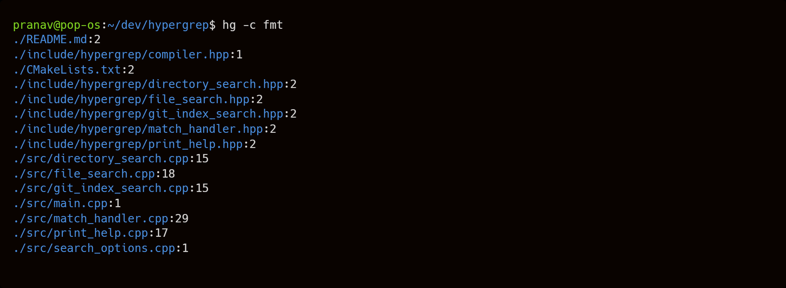
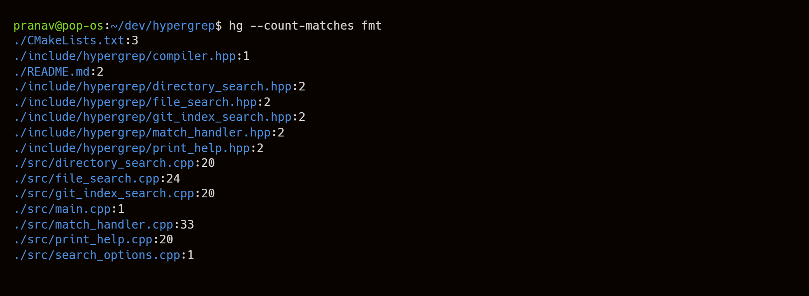
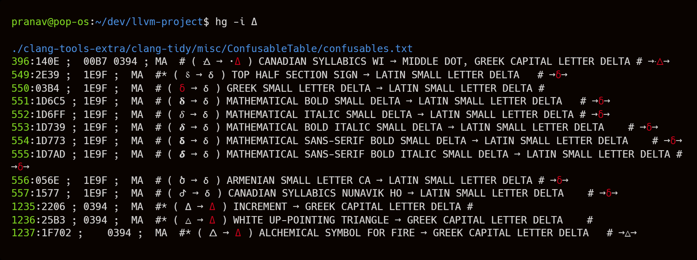
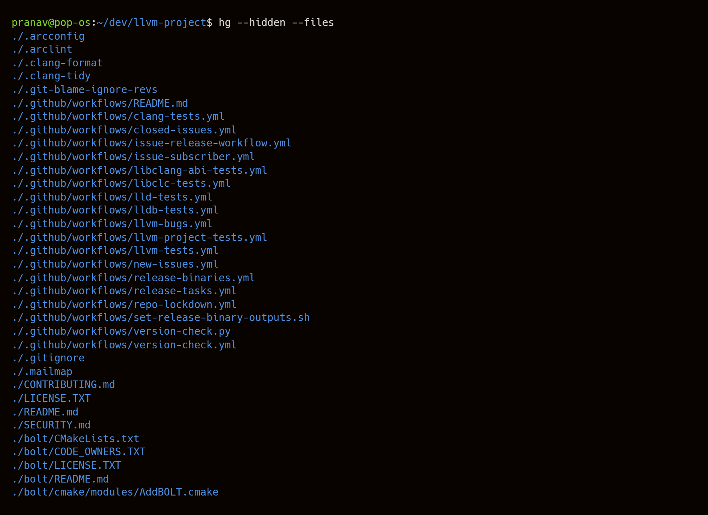
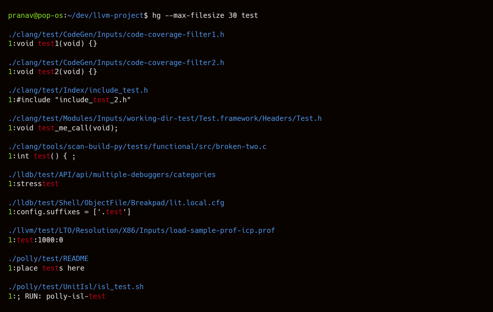

# Table of Contents

- [Getting Started](#getting-started)
  * [Simple Search](#simple-search)
  * [Multiple Patterns](#multiple-patterns)
    - [Patterns in the command line (`-e/--regexp` option)](#patterns-in-the-command-line-with--e--regexp-option)
    - [Patterns in a PATTERNFILE (`-f/--file` option)](#patterns-in-a-pattern-file-with--f--file-option)
  * [Search Options](#search-options)
    - [Byte Offset (`--byte-offset` option)](#byte-offset)
    - [Column Number (`--column` option)](#column-number)
    - [Count Matching Lines (`-c/--count` option)](#count-matching-lines)
    - [Count Matches (`--count-matches` option)](#count-matches)
    - [Fixed Strings (`--fixed-strings` option)](#fixed-strings)
    - [Ignore Case (`-i/--ignore-case` option)](#ignore-case)
    - [Limit Output Line Length (`--max-columns` option)](#limit-output-line-length)
    - [Show/Hide Line Number](#showhide-line-number)
    - [Print Only Matching Parts](#print-only-matching-parts)
  * [Which Files?](#which-files)
    - [List Files Without Searching (`--files` option)](#list-files-without-searching)
    - [List Files With Matches (`-l/--files-with-matches` option)](#list-files-with-matches)
    - [Filtering Files (`--filter` option)](#filtering-files)
    - [Negating the Filter](#negating-the-filter)
    - [Hidden Files](#hidden-files)
    - [Limiting File Size (`--max-filesize`)](#limiting-file-size)
  * [Git Repositories](#git-repositories)
    - [Ignore Submodules](#ignore-submodules) 
    - [Ignore Git Index](#ignore-git-index)
- [Usage](#usage)
- [Options](#options)

# Getting Started

The implementation of `hypergrep` is based on `grep` and `ripgrep`. 

The program can be used in one of a few different ways:

1. Single pattern, searching a single path (if no path is provided, the current directory is searched).
1. Single pattern, searching multiple paths.
2. Multiple patterns provided via `-e` option, searching multiple paths.
3. Multiple patterns provided via a pattern file, searching multiple paths.
4. No patterns, just interested in what files _will_ be searched (using `--files`)

## Simple Search

The simplest of these is searching the current working directory for a single pattern. The following example searches the current directory for the literal pattern `mmap`.
  

  
The output indicates 4 matches across 2 different files.
  
When piping `hypergrep` output to another program, e.g., `wc` or `cat`, the output changes to a different format where each line represents a line of output. 
  

  
## Multiple Patterns
  
Multiple independent patterns can be provided in two ways: 

1. Using `-e/--regexp` and providing each pattern in the command line
2. Using `-f/--gile` and providing a pattern file, which contains multiple patterns, one per line. 

### Patterns in the command line with `-e/--regexp` option

Use `-e` to provide multiple patterns, one after another, in the same command


### Patterns in a pattern file with `-f/--file` option

Consider the pattern file `list_of_patterns.txt` with two lines:

```txt
hs_scan
fmt::print\("{}"
```

This file can be used to search multiple patterns at once using the `-f/--file` option:


## Search Options

### Byte Offset
  
In addition to line numbers, the byte offset or the column number can be printed for each matching line.

Use `-b/--byte-offset` to get the 0-based byte offset of the matching line in the file. 


### Column Number
  
Use `--column` to get the 1-based column number for the first-match in any matching line.


### Count Matching Lines

Use `-c/--count` to count the number of matching lines in each file. Note that multiple matches per line still counts as 1 matching line.



### Count Matches

Use `--count-matches` to count the number of matches in each file. If there are multiple matches per line, these are individually counted.



### Fixed Strings

Pure literal is a special case of regular expression. A character sequence is regarded as a pure literal if and only if each character is read and interpreted independently. No syntax association happens between any adjacent characters.

For example, given an expression written as `/bc?/`. We could say it is a regular expression, with the meaning that character `b` followed by nothing or by one character `c`. On the other view, we could also say it is a pure literal expression, with the meaning that this is a character sequence of `3-byte` length, containing characters `b`, `c` and `?`. In regular case, the question mark character `?` has a particular syntax role called `0-1` quantifier, which has a syntax association with the character ahead of it. Similar characters exist in regular grammar like `[`, `]`, `(`, `)`, `{`, `}`, `-`, `*`, `+`, `\`, `|`, `/`, `:`, `^`, `.`, `$`. While in pure literal case, all these meta characters lost extra meanings expect for that they are just common ASCII codes.

Use `-F/--fixed-strings` to specify that the regex pattern is a pure literal. Note in the following example that the special characters in the pattern are not escaped - they are considered as is.


### Ignore Case

`hypergrep` search can be performed case-insensitively using the `-i/--ignore-case` option. Here's an example search for both the upper-case (`Δ`) and lower-case (`δ`) version of the greek letter delta.



### Limit Output Line Length

TODO

### Show/Hide Line Number

TODO

### Print Only Matching Parts

TODO

## Which Files?

### List Files Without Searching

Sometimes, it is necessary to check which files `hypergrep` chooses to search in any directory. Use `--files` to print a list of all files that `hypergrep` will consider.


Note in the above example that hidden files and directories are ignored by default.

### List Files With Matches

If you only care about which files have the matches, and not necessarily what the matches are, use `-l/--files-with-matches` to get a list of all the files with matches.


### Filtering Files

Use `--filter` to filter the files being searched. Only files that positively match the filter pattern will be searched. 


NOTE that this is not a glob pattern but a PCRE pattern.

The following pattern, `googletest/(include|src)/.*\.(cpp|hpp|c|h)$`, matches any C/C++ source file in any `googletest/include` and `googletest/src` subdirectory. 


Running in the `/usr` directory and searching for any shared library, here's the performance:

| Command | Number of Files | Time |
| --- | --- | --- |
| `find . -name "*.so" \| wc -l` | 1851	| 0.293 |	
| `rg -g "*.so" --files \| wc -l` | 1621 | 0.082 |
| `hg --filter '\.so$' --files \| wc -l` | 1621 | **0.043** |

### Negating the Filter

This sort of filtering can be negated by prefixing the filter with the `!` character, e.g.,: the pattern `!\.(cpp|hpp)$` will match any file that is NOT a C++ source file.


### Hidden Files

By default, hidden files and directories are skipped. A file or directory is considered hidden if its base name starts with a dot character (`'.'`).

You can include hidden files and directories in the search using the `--hidden` option. 



### Limiting File Size

If you want to filter out files over a certain size, you can use `--max-filesize` to provide a file size specification. The input accepts suffixes of form `K`, `M` or `G`. If no suffix is provided the input is treated as bytes e.g., the following search filters out any files over 30 bytes in size.



## Git Repositories

TODO

### Ignore Submodules

TODO

### Ignore Git Index

TODO

# Usage

```bash
hg [OPTIONS] PATTERN [PATH ...]
hg [OPTIONS] -e PATTERN ... [PATH ...]
hg [OPTIONS] -f PATTERNFILE ... [PATH ...]
hg [OPTIONS] --files [PATH ...]
hg [OPTIONS] --help
hg [OPTIONS] --version
```

# Options

| Name | Description | 
| --- | --- |
| `-b, --byte-offset` | Print the 0-based byte offset within the input file before each line of output. If `-o` (`--only-matching`) is used, print the offset of the matching part itself. |
| `--column` | Show column numbers (1-based). This only shows the column numbers for the first match on each line. |
| `-c, --count` | This flag suppresses normal output and shows the number of lines that match the given pattern for each file searched | 
| `--count-matches` | This flag suppresses normal output and shows the number of individual matches of the given pattern for each file searched | 
| `-e, --regexp <PATTERN>...` | A pattern to search for. This option can be provided multiple times, where all patterns given are searched. Lines matching at least one of the provided patterns are printed, e.g.,<br/><br/>`hg -e 'myFunctionCall' -e 'myErrorCallback'`<br/><br/>will search for any occurrence of either of the patterns. |
| `-f, --files <PATTERNFILE>...` | Search for patterns from the given file, with one pattern per line. When this flag is used multiple times or in combination with the `-e/---regexp` flag, then all patterns provided are searched. |
| `--files` | Print each file that would be searched without actually performing the search |
| `--filter <FILTERPATTERN>` | Filter paths based on a regex pattern, e.g.,<br/><br/>`hg --filter '(include\|src)/.*\.(c\|cpp\|h\|hpp)$'`<br/><br/>will search C/C++ files in the any `*/include/*` and `*/src/*` paths.<br/><br/>A filter can be negated by prefixing the pattern with !, e.g.,<br/><br/>`hg --filter '!\.html$'`<br/><br/>will search any files that are not HTML files. |
| `-F, --fixed-strings` | Treat the pattern as a literal string instead of a regex. Special regex meta characters such as `.(){}*+` do not need to be escaped. |
| `-h, --help` | Display help message. |
| `--hidden` | Search hidden files and directories. By default, hidden files and directories are skipped. A file or directory is considered hidden if its base name starts with a dot character (`'.'`). |
| `-i, --ignore-case` | When this flag is provided, the given patterns will be searched case insensitively. The <PATTERN> may still use PCRE tokens (notably `(?i)` and `(?-i)`) to toggle case-insensitive matching. |
| `--ignore-gitindex` | By default, hypergrep will check for the presence of a `.git/` directory in any path being searched. If a `.git/` directory is found, hypergrep will attempt to find and load the git index file. Once loaded, the git index entries will be iterated and searched. Using `--ignore-gitindex` will disable this behavior. Instead, hypergrep will search this path as if it were a normal directory. |
| `--ignore-submodules` | For any detected git repository, this option will cause hypergrep to exclude any submodules found. | 
| `--include-zero` | When used with `--count` or `--count-matches`, print the number of matches for each file even if there were zero matches. This is distabled by default. | 
| `-I, --no-filename` | Never print the file path with the matched lines. This is the default when searching one file or stdin. | 
| `-l, --files-with-matches` | Print the paths with at least one match and suppress match contents. |
| `-M, --max-columns <NUM>` | Don't print lines longer than this limit in bytes. Longer lines are omitted, and only the number of matches in that line is printed. |
| `--max-filesize <NUM+SUFFIX?>` | Ignore files above a certain size. The input accepts suffixes of form `K`, `M` or `G`. If no suffix is provided the input is treated as bytes e.g.,<br/><br/>`hg --max-filesize 50K`<br/><br/>will search any files under `50KB` in size. |
| `-n, --line-number` | Show line numbers (1-based). This is enabled by defauled when searching in a terminal. | 
| `-N, --no-line-number` | Suppress line numbers. This is enabled by default when not searching in a terminal. | 
| `-o, --only-matching` | Print only matched parts of a matching line, with each such part on a separate output line. | 
| `--ucp` | Use unicode properties, rather than the default ASCII interpretations, for character mnemonics like `\w` and `\s` as well as the POSIX character classes. |
| `-v, --version` | Display the version information. |
| `-w, --word-regexp` | Only show matches surrounded by word boundaries. This is equivalent to putting `\b` before and after the the search pattern. |
